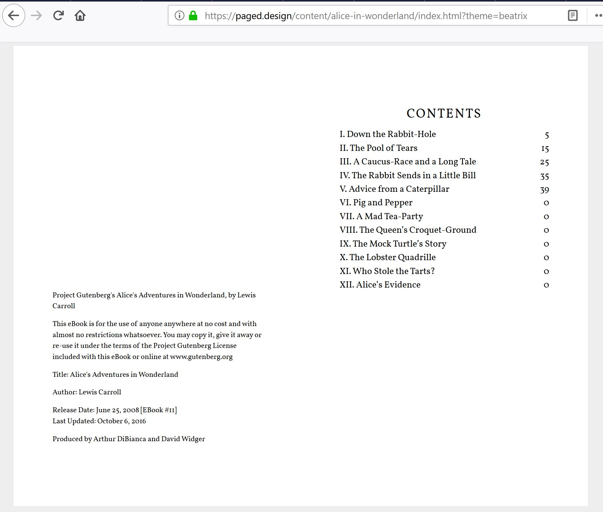

```{r setup, include=FALSE}
options(htmltools.dir.version = FALSE)
knitr::opts_chunk$set(echo = FALSE, warning = FALSE, message = FALSE)
library(ggplot2)
```

# Benefits and Limitations of $\LaTeX$ in the use of document publishing

.left-column.no-padding[
Great because:
* Structured writing  
* Separate content from styling  
* Scientific features 

However:
* Learning curve
* Requires maintenance
* Experts hard to find  

[LaTeX is Dead (long live LaTeX)](https://www.authorea.com/users/5713/articles/19359-latex-is-dead-long-live-latex-typesetting-in-the-digital-age/_show_article)
]

.right-column[
  .pull-left[
    
  ]
  
  .pull-right[
    
  ]
]

???

Benefits: 
- encourages structured writing: focus on thinking, expressing thoughts in writing
- separate content from styling: focus on what you're trying to communicate, others work on visual organization
- scientific features: easy citations/references. Equations/tables can be inserted

Limitations:
- learning curve: not WYSIWYG (like Word), define structures with commmands, add dependencies
- required maintenance: changing one thing could break others, fault of dependencies and internal
- experts hard to find: academic writing != publishing capabilities, full time staff needed

---

# Reproducible Workflow using R Markdown

.left-column[
R Markdown Combines: 

* Prose 
* Code 
* Results 

Output formats:

* Web documents __`.html`__
* Static documents with LaTeX __`.pdf`__ 
* MS Word __`.docx`__ 
* Powerpoint __`.pptx`__
* EPUB __`.epub`__

]

.right-column[

.pull-left[

1. Text in markdown:  
 
  .center[Write \&#95;\&#95;what\&#95;\&#95; you want \&#95;however\&#95; you want]
  .center[`r fontawesome::fa(name = "arrow-down", height = "12pt", fill = "black")`] 
  .center[Write __what__ you want _however_ you want]  
 
2. Inline or Chunks of Code:  
  
  .center[Today's date is \&#96;\&#96; `r knitr::inline_expr("Sys.Date()")` \&#96;\&#96;]
  .center[`r fontawesome::fa(name = "arrow-down", height = "12pt", fill = "black")`] 
  .center[Today's date is `r Sys.Date()`]  
 
3. Figures:
  .center[
 
```{r fig.height=1.5, fig.width=4}
ggplot(mtcars) +
  geom_histogram(aes(x = mpg)) +
  theme(axis.title.x = element_blank())
```
    ]
  ]
  
  .pull-right[
    
  ]
]

???

Reproducible documents: If error discovered, or if additional data, can just re-compile the report and get new or corrected results. Versus having to reconstruct figures and tables, paste them into a Word document, and further hand-edit various detailed results. **LITERATE PROGRAMMING**
---

# Paged Documents with HTML & CSS

.left-column[
  
  
]

.right-column[
  Possible using _Paged.js_ 
    - open-source library for paging content in a browser   
    
  Based on CSS3 Paged Media 
    - Create/Avoid page breaks 
    - Page properties specified (size, orientation, margins, etc.) 
    - Headers/Footers within page margins
    
  Output is a webpage (no download)
    - Interactivity (JavaScript, D3, CSS)
    - Chrome's Print to PDF 
]

???

Paged.js is a _polyfill_ for Paged Media and Generated Content for Paged Media CSS modules

A polyfill is code that implements a feature on web browsers that do not support the feature

In development, so expect bugs, workarounds, and exciting possibilities

---

# Paged Documents with HTML & CSS

.pull-left[
  
  [Paged Design](https://paged.design/)
]

.pull-right[

```{css, echo = TRUE}
@page {
  size: A5;
}
# or
@page {
  size: 140mm 200mm;
}
```

```{css, echo = TRUE}
@page {
  margin: 1in 2in .5in 2in;
}
@page {
  @top-center {
        content: "Moby-Dick";
  }
}
```

```{css, echo = TRUE}
h1 {
      break-before: page;
}
```

]

???

Example of paged document on left by paged.design

Use CSS to specify:
 - the size of the pages
 - dimensions and content of margins
 - where to fragment text (page breaks)

---

# How any R user can get started 

.left-column[

Paginated HTML with R Markdown:   [pagedown](https://github.com/rstudio/pagedown)  

Current templates include [JSS article, CV, letter, business cards](https://pagedown.rbind.io/#applications)
]
.right-column[
  .pull-left[
    
  ]
  .pull-right[
    
  ]
] 

???

Uses Paged.js polyfill to implement CSS support 
R Markdown document, means all the advantages are available
Most stable in Chrome browser
Customizable using HTML/CSS:
 - add university design
 - work with marketing dept/webmaster
 - Combine the content creation and styling
 - Perfect for reports where styling does not change a lot (annual reports)
 
---
background-image: url(https://user-images.githubusercontent.com/19177171/51005498-5b46cb80-153f-11e9-9026-4b50a9f3d3f1.png)
background-size: contain

???
Journal of Statistical Software article

---
background-image: url(https://user-images.githubusercontent.com/163582/46879762-7a34a500-ce0c-11e8-87e3-496f3577ff05.png)
background-size: contain

???
Resume

---
background-image: url(https://user-images.githubusercontent.com/163582/47741877-68933000-dc49-11e8-94f8-92724b67e9a6.png)
background-size: contain


???
Business cards

---
background-image: url(https://user-images.githubusercontent.com/163582/47872372-61e8f200-dddc-11e8-839b-d8e8ef8f51eb.png)
background-size: contain

???
Letters

---
background-image: url(https://user-images.githubusercontent.com/163582/47673682-58b11880-db83-11e8-87fd-b5e753af7288.png)
background-size: contain

???
Paged Document (general)

---
layout: false
class: inverse, middle, center

# RStudio Cloud Project

https://rstudio.cloud/project/1019060

---

layout: true

---
count: false
# Acknowledgements

.pull-left[
* [Xaringan](https://slides.yihui.name/xaringan/#1) package (used to create these slides)
  + Yihui Xie [`r fontawesome::fa(name = "github-square", height= "24pt", fill = "#41717a")`](https://github.com/yihui)
    [`r fontawesome::fa(name = "twitter-square", height= "24pt", fill = "#41717a")`](https://twitter.com/xieyihui)

* [Pagedown](https://pagedown.rbind.io/) package
  + Yihui Xie [`r fontawesome::fa(name = "github-square", height= "24pt", fill = "#41717a")`](https://github.com/yihui)
    [`r fontawesome::fa(name = "twitter-square", height= "24pt", fill = "#41717a")`](https://twitter.com/jdbarillas)
  + Romain Lesur [`r fontawesome::fa(name = "github-square", height= "24pt", fill = "#41717a")`](https://github.com/RLesur)
    [`r fontawesome::fa(name = "twitter-square", height= "24pt", fill = "#41717a")`](https://twitter.com/RLesur)
  
* [xaringanthemer](https://www.garrickadenbuie.com/project/xaringanthemer/) Garrick Aden-Buie [`r fontawesome::fa(name = "github-square", height= "24pt", fill = "#41717a")`](https://github.com/gadenbuie/)
    [`r fontawesome::fa(name = "twitter-square", height= "24pt", fill = "#41717a")`](https://twitter.com/grrrck)
    
* [Paged.js](https://www.pagedjs.org/) team: 
  + Adam Hyde
  + Julie Blanc
  + Fred Chasen
  + Julien Taquet
]

.pull-right[
  

  


]
